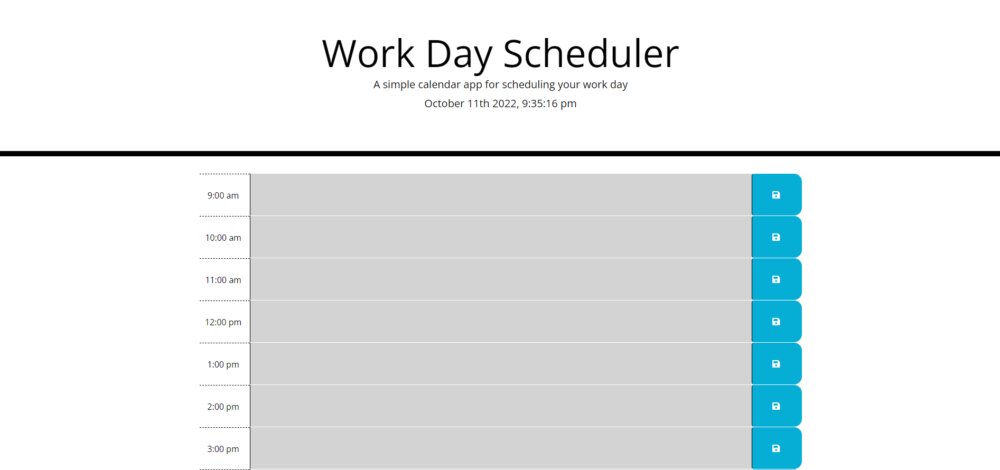

# m5-time-manager

## Description

This application is a workday scheduler, built to place items to be done throughout the working hours of the day (9-5), and help to manage your use of time throughout the day.
While building this project I learned how to:

- Utilize bootstrap jumbotron, rows and columns to create a structure with a quick framework
- set/get items into/from local storage 
- Use moment.js to display the current date and time, and for highlighting time blocks as past/current/future.
- Use jquery rather than vanilla JS to make the js file cleaner.
- Grab icons from fontawesome and include them like the floppy disk icon as a save indicator for the save button

## Link to Deployed Site

To view the project click here: [Workday Scheduler](https://benjamincottrell.github.io/m5-time-manager/)

## Screenshots



## Assignment Instructions

### User Story

```
AS AN employee with a busy schedule
I WANT to add important events to a daily planner
SO THAT I can manage my time effectively
```

### Acceptance Criteria

```
GIVEN I am using a daily planner to create a schedule
WHEN I open the planner
THEN the current day is displayed at the top of the calendar
WHEN I scroll down
THEN I am presented with time blocks for standard business hours
WHEN I view the time blocks for that day
THEN each time block is color-coded to indicate whether it is in the past, present, or future
WHEN I click into a time block
THEN I can enter an event
WHEN I click the save button for that time block
THEN the text for that event is saved in local storage
WHEN I refresh the page
THEN the saved events persist
```

## Credits
Credit to this guide that helped me to understand how to use local storage https://blog.logrocket.com/localstorage-javascript-complete-guide/
